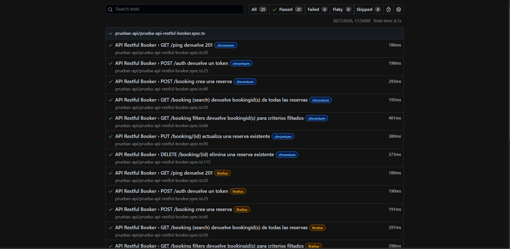

# Playwright + TypeScript — Portfolio de pruebas de API

Este proyecto muestra un ejemplo completo de automatización de pruebas de API con Playwright y TypeScript. Está pensado como una base sólida para portfolio porque combina buenas prácticas de organización, reutilización de código, configuración de entorno y reportes ejecutables.



## Qué se implementó

Se desarrolló una suite de pruebas API contra Restful Booker que cubre:

- verificación de salud del servicio
- autenticación con token
- creación de reservas
- búsqueda de reservas por listado y filtros
- actualización de reservas
- eliminación de reservas

La automatización está organizada para que los test queden legibles, reutilizables y fáciles de escalar.

## Qué se hizo en la configuración

La configuración principal está en [playwright.config.ts](playwright.config.ts). Allí se define:

- el directorio de tests: [tests](tests)
- ejecución en 3 navegadores: Chromium, Firefox y WebKit
- reportes HTML y por consola
- timeouts de navegación y espera
- la URL base del proyecto

También se usa una configuración especial en [tests/api/restful-booker-api.spec.ts](tests/api/restful-booker-api.spec.ts) para ejecutar ciertos casos de forma serial, lo que ayuda a mantener el estado entre pruebas como login, creación, actualización y borrado.

## Estructura del proyecto

```text
Playwright-TypeScript/
├── src/
│   ├── config/                # Variables de entorno y configuración
│   ├── data/                  # Datos reutilizables para las pruebas
│   └── service/               # Cliente y lógica de consumo de API
├── tests/
│   ├── api/                   # Casos de prueba de API
│   ├── fixtures/              # Fixtures personalizados
│   └── utils/                 # Helpers compartidos de test
├── playwright-report/         # Reporte HTML generado por Playwright
├── playwright.config.ts       # Configuración general del runner
├── package.json               # Scripts y dependencias
└── README.md                  # Documentación del proyecto
```

## Organización del proyecto

- [src/service](src/service): encapsula la comunicación con la API mediante métodos como login, crear reserva, actualizar reserva o eliminar reserva.
- [src/config](src/config): centraliza variables de entorno como la URL base y credenciales.
- [src/data](src/data): guarda payloads y datos de prueba reutilizables.
- [tests/api](tests/api): contiene los escenarios de negocio automatizados.
- [tests/fixtures](tests/fixtures): define fixtures para inyectar el cliente API en los tests.
- [tests/utils](tests/utils): concentra utilidades compartidas cerca de los tests para evitar imports más largos.

## Dónde se corren los tests

Los tests se ejecutan desde la raíz del proyecto, en la carpeta principal del repositorio.

## Comandos importantes

Instalación:

```bash
npm install
```

Crear el archivo de entorno si corresponde:

```bash
cp .env.example .env
```

Ejecutar toda la suite:

```bash
npm test
```

Ejecutar solo las pruebas de API:

```bash
npm run test:api
```

Ejecutar con un solo worker (útil en Windows o para depurar):

```bash
npm run test:1-worker
```

Ejecutar en un navegador específico:

```bash
npx playwright test --project=chromium
```

Ver el reporte HTML generado:

```bash
npm run test:report
```

Verificar tipado de TypeScript:

```bash
npm run typecheck
```

## Reporte generado

El reporte HTML queda disponible en [playwright-report/index.html](playwright-report/index.html). Esto permite revisar la ejecución de los tests de forma visual y compartir resultados de manera profesional.

Si alguien quiere verlo sin abrirlo manualmente, también puede ejecutarlo con:

```bash
npm run test:report
```

Así se levanta una vista del reporte en el navegador directamente desde el proyecto.

## Resultado esperado

Este proyecto demuestra capacidad para:

- automatizar pruebas de API con Playwright
- trabajar con servicios REST reales
- estructurar proyectos para mantenerlos escalables
- generar evidencia visual de ejecución para portfolio
